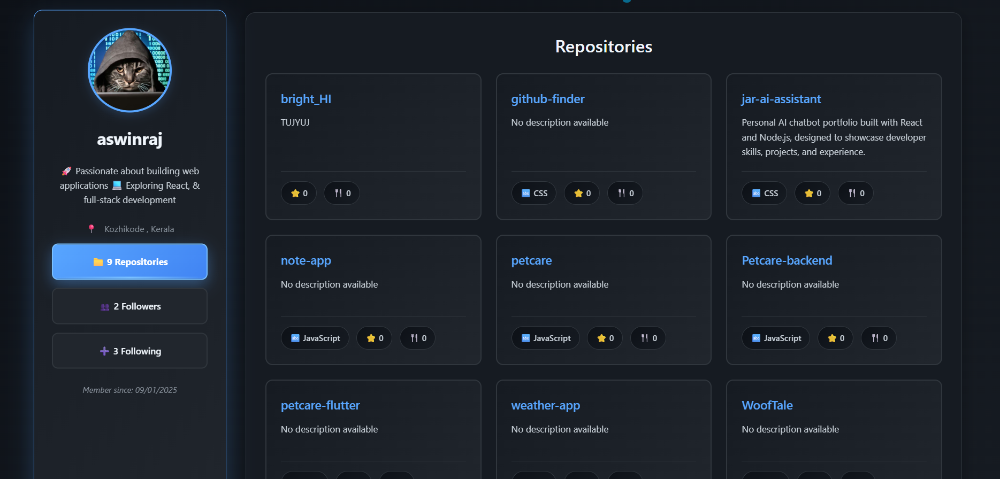

# GitHub Finder 🔍

A modern and responsive **GitHub Finder** built with **React**, allowing users to search GitHub profiles and explore their followers, following, and repositories through an intuitive interface.

## 🌐 Live Demo

👉 [Live Demo](YOUR_LIVE_LINK_HERE)

## 📂 Source Code

👉 https://github.com/aswinrajkallil/github-finder

---

## ✨ Features

- 🔎 Search GitHub users by username
- 👤 View user profile details:
  - Avatar
  - Name
  - Bio
  - Location
  - Company
  - Blog
  - Twitter username
  - Account creation date
- 👥 Explore followers
- ➕ View following users
- 📁 Browse public repositories
- 🔗 Direct links to GitHub profiles and repositories
- 🌙 GitHub-inspired dark theme
- 📱 Fully responsive design for mobile, tablet, and desktop
- ⚡ Fast performance powered by Vite
- 🎨 Interactive UI with smooth hover effects and transitions

---

## 🛠️ Tech Stack

### Frontend
- React
- React Router
- JavaScript (ES6+)
- CSS3
- Vite

### APIs
- GitHub REST API

---


### Home Page

## 📸 Screenshot



---

## 🚀 Installation

Clone the repository:

```bash
git clone https://github.com/aswinrajkallil/github-finder.git
```

Navigate to the project directory:

```bash
cd github-finder
```

Install dependencies:

```bash
npm install
```

Start the development server:

```bash
npm run dev
```

Open your browser and visit:

```text
http://localhost:5173
```

---

## 📁 Project Structure

```text
github-finder/
│
├── public/
├── src/
│   ├── Components/
│   │   ├── Pages/
│   │   │   ├── Followers.jsx
│   │   │   ├── Following.jsx
│   │   │   └── Repositories.jsx
│   │   ├── SearchBar.jsx
│   │   └── UserCard.jsx
│   │
│   ├── assets/
│   ├── App.jsx
│   ├── main.jsx
│   └── index.css
│
├── package.json
├── vite.config.js
└── README.md
```

---

## 🎯 What I Learned

Through this project, I improved my understanding of:

- React Hooks (`useState`)
- Working with REST APIs
- Fetching asynchronous data
- React Router navigation
- Passing data using route state
- Responsive web design
- Component-based architecture
- Building polished portfolio projects

---

## 🔮 Future Improvements

- [ ] Search history
- [ ] Pagination for repositories and followers
- [ ] Repository filtering and sorting
- [ ] GitHub contribution graph integration
- [ ] Improved error handling UI
- [ ] Loading skeletons/spinners
- [ ] Theme switcher (Light/Dark Mode)

---

## 🤝 Contributing

Contributions, suggestions, and feedback are welcome.

Feel free to fork the project and submit a pull request.

---

## 📧 Contact

**Aswin Raj**

- GitHub: https://github.com/aswinrajkallil
- LinkedIn: https://linkedin.com/in/aswinrajkallil
- Portfolio: https://aswinraj.dev

---

## 📜 License

This project is licensed under the MIT License.

---

⭐ If you found this project helpful, consider giving it a star on GitHub!
